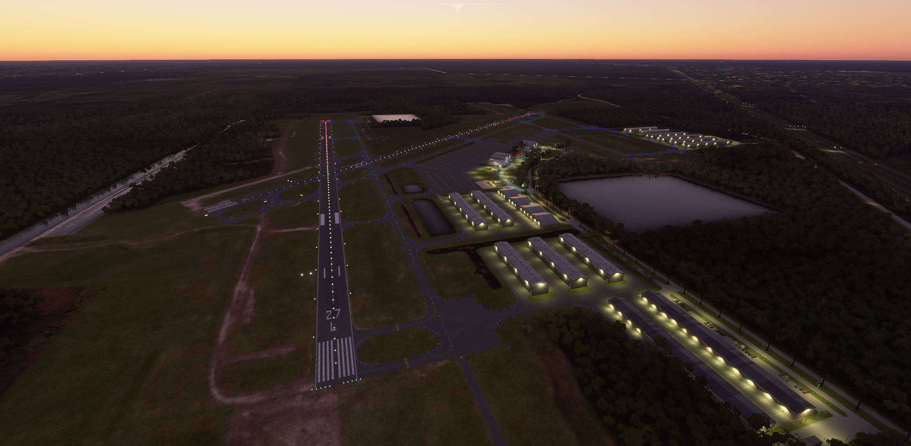
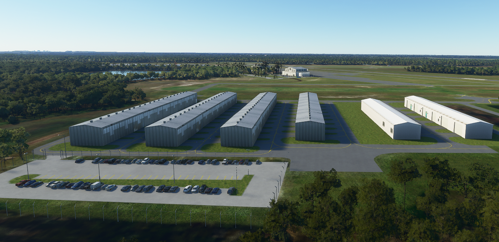
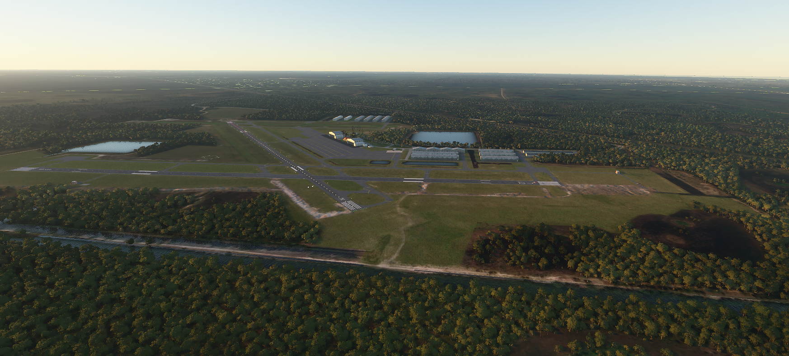

# F45 - North Palm Beach County General Aviation Airport
#### Author: Julysfire
Discord: julysfire#9465        MSFS2020: blackflame0729

##### Description
F45 - North Palm Beach County General Aviation Airport in West Palm Beach, Florida 

Cords: 26°50'47.3"N 80°13'15.8"W

##### Summary

North Palm Beach County General Aviation Airport is 12 nm NW of West Palm Beach, Florida off the Bee Line Highway.  The airport is owned by Palm Beach County.  North Palm Beach County airport is approx 10 miles from the coast and just under 20 miles from Palm Beach International Airport.

AirNav: <https://www.airnav.com/airport/f45>

Wikipedia: <https://en.wikipedia.org/wiki/North_Palm_Beach_County_General_Aviation_Airport>

Google Maps <https://goo.gl/maps/ZxDzRmf1XTkqWks19>

### Release Notes

Release: V1.1.0

- Taxiways and runways should now line up and are named.
- Added taxiway signs.
- Added light row support.
- Smoothed out some taxiways.
- [ILS Runway 9R](https://aeronav.faa.gov/d-tpp/2011/09151IL9R.PDF) now should be working.  I should note, the approach plate is a bit glitchy at the moment due to the SDK's handling.  The actual ILS is there however on 110.75 and you can tune to the frequency for glideslope and path.
- Added REILs to runways that needed them.
- Fixed a backwards painted line that led to taxiway M.
- Fixed and improved on some painted lines not lining up.
- Fixed the radio tower in the lake.
- Fixed a missed taxiway turn that should have been curved.
- Fixed some taxiways having extra lights.
- Fixed some parking spots' headings.
- Fixed some other apron issues.

Next up is the custom hangar models.  I have learned a lot about Blender and modeling since creating these.  I have decided not to add the RNAV approaches at this time as the approaches are a bit glitchy and not well supported right now.  Once things are in a better spot for including them, I will add the remaining approaches.

##### Features

- **Entire airport that is not currently in the base game**

- Hand crafted airport and scenery
- Hand crafted 3D hangars
- Plenty of GA parking spots
- Fixed road leading into area (Aviation Road), FL-710, and FL-786 roads
- Fixed many of the buildings that didn't auto generate
- Better ground textures and vegetation of the surrounding area
- Realistic look and feel based on satellite imagery
- Realistic night lighting around the hangars/runway/aprons

#### ---Installation Instructions---
1. Download the .zip file from Releases (or zip file here)
2. Extract files to the your Microsoft Flight Simulator Community Folder

For the Microsoft Store edition AND/OR Gamepass edition:

	C:\Users\[YOUR USERNAME]\AppData\Local\Packages\Microsoft.FlightSimulator_<RANDOMLETTERS>\LocalCache\Packages\Community
	
For the Steam edition:

	C:\Users\[YOUR USERNAME]\AppData\Roaming\Microsoft Flight Simulator\Packages\Community

## Screenshots

##### TODO

- Improve on custom 3D models.  This was the first time learning/using Blender.  Definately improvement to be made here.
- There is an issue where adding any water will auto terraform that will create a new Great Lake...figure out why it keeps doing this and add more water to the area.
- Find an accurate diagram for including more taxiway signs.  EDIT: Found.  Will update soon.
- Fix any bugs/issues that may arise.

If you enjoyed it as well and would like to donate, it is very much appreciated but never will be required.  I am doing this to add to the community and because I found I enjoyed it.
http://paypal.me/julysfire or <https://www.buymeacoffee.com/julysfire>